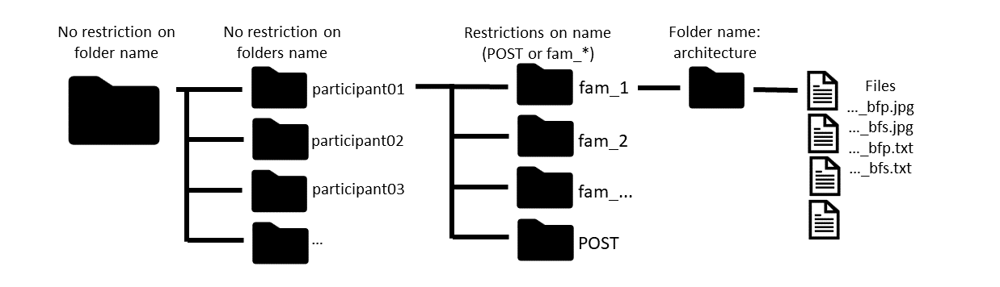

====================
AponeurosesDetection
====================

.. image:: https://img.shields.io/pypi/v/aponeurosesdetection.svg
        :target: https://pypi.python.org/pypi/aponeurosesdetection

.. image:: https://img.shields.io/travis/Lisa-pa/aponeurosesdetection.svg
        :target: https://travis-ci.com/Lisa-pa/aponeurosesdetection

.. image:: https://readthedocs.org/projects/aponeurosesdetection/badge/?version=latest
        :target: https://aponeurosesdetection.readthedocs.io/en/latest/?badge=latest
        :alt: Documentation Status

This package contains functions that will enable automatic aponeuroses and tubular structures detection in ultrasound images.

* Free software: MIT license
* Documentation: https://aponeurosesdetection.readthedocs.io.

Features
--------
        TO DO

How to use this package?
--------
* How to compare manual and automated estimations of muscle architecture parameters ?
        See prerequisites on the structure  of the folder containing your images.
        To analyse US images automatically and compare the results with manual labelling with this package, open the filemanager.py file and adapt the 
                - path_to_folder variable (path to the folder that contains the images);
                - part variable (list of participants);
                - colors variable (list of colors for the visualization);
        then run the file !

* How to automatically analyze a panoramic image?

::

        >>>import aponeurosesdetection.autoP as autoP
        >>>dict_results = autoP.panoprocessing(path_to_image, path_to_txtfile)

* How to automatically analyze a simple image?

::

        >>>import aponeurosesdetection.autoS as autoS
        >>>dict_results = autoS.simpleprocessing(path_to_img)

What happens when you run the filemanager.py file?
--------
        - Simple images
                0) Estimation of parameters from the manually labelled data.
                1) Start of the  automated processing
                        The image appears with a window asking you to validate the start of the analysis.
                2) Detection of scale
                        Scale is automatically detected for the estimation of calibration factors.
                3) Cropping of the image to obtain the region of interest (aponeuroses + fascicles in between)
                        The image is automatically cropped and a window asks you to validate the cropping.
                        
                        The cropping is based on the evaluation of the mean of pixels value per row/column. Those means are compared to thresholds to detect the region where there is the actual US image.
                        Initial thresholds are set to (10, 15, 12, 25, 2, 6). In some cases, no image is output, so a second automatic try is launched with thresholds (6, 15, 6, 25, 0, 0).
                        (to check which thresholds have been used, have a look at the command window).
                         If the cropping is not validated byt the user, new thresholds are asked (a user can try thresholds maximum 5 times per image).
                          - Case a) The cropping is too aggressive (often happens in case of darker images). Try thresholds (6, 15, 6, 25, 0, 0) (that is, reduce 1st and 3rd thresholds).
                          - Case b) you want to crop more (or less!) at the top or at the bottom of the image: adapt the last 2 thresholds, that correspond to additional cropping (in mm) at the top and at the bottom of the image respectively. This is an interesting option in case of an image that presents large white bands different from aponeuroses: by eliminating these bands, you increase your chances to obtain a correct processing.
                4) Search for aponeuroses
                        (1st: superficial aponeurosis; 2nd: deep aponeurosis)
                        Maximum 10,000 iterations for the search of one aponeurosis. You can follow the iterations in the command window.

                        A window asks you to validate the contour of the aponeurosis if it has been found.
                        If not satisfied, a second try is launched.
                        If the aponeurosis is not found or the contour does not satisfy the user, then
                        a linear approximation of the location of the aponeurosis is used.
                5) Search for muscle fascicles
                        Automatic detection of portions of fascicles.
                6) Visualization
                        The final image with the detected aponeuroses (in blue) and the fascicles (in green) appears. Close it to move on to the following image.

        - Panoramic images
                0) Estimation of parameters from the manually labelled data.
                1) Start of the automated processing
                        The image appears with a window asking you to validate the start of the analysis.
                2) Detection of scale
                        Scale is automatically detected for the estimation of calibration factors.
                3) Cropping of the image to obtain the region of interest (aponeuroses + fascicles in between)
                        The image is cropped according to manually labelled data that is stored in txt file.
                        The cropped image appears in a window. Close it to move on.
                4) Search for aponeuroses
                        The image is divided vertically into sub-images to look for aponeuroses.
                        The size of sub-images depends on the width of the cropped image.
                        
                        Per sub-image, the search for aponeuroses follows the same process as for simple images. Superficial aponeurosis is searched all along the cropped image. Deep aponeurosis is searched only in the first half of the cropped image, according to our observations on our panoramic images of the biceps femoris.
                        
                        Once all sub-images have been processed, aponeuroses are fitted with 2-degree polynomes (meaning, if aponeuroses are not found in a sub-image, this is not a problem; to ensure the fitting of aponeuroses, at least one portion of each aponeurosis should be found among all sub-images. However the more portions of aponeuroses are detected, the better the estimation would be).
                5) Search for fascicles
                        Automatic detection of portions of fascicles sub-image by sub-image before reunification.
                6) Visualization
                        - the original image with the intersection points between fascicles and aponeuroses
                        - the cropped image with fascicles (in green) and aponeuroses (in blue)
                        Close them to move on to the following image.

        - Outputs
                * Dictionnary
                        A dictionnary containing all the results is available in the original folder.
                
                * Plots
                        When the data set has been fully processed, 10 plots are created to visualize results (5 plots for simple images, 5 plots for panoramic images):
                                - 1 plot for the comparison of calibration factors (auto vs. manual);
                                - 1 plot for the comparison of fascicle lengths estimation (auto vs. manual);
                                - 1 plot for the comparison of pennation angles estimation with superficial aponeurosis (auto vs. manual);
                                - 1 plot for the comparison of pennation angles estimation with deep aponeurosis (auto vs. manual);
                                - 1 plot for the comparison of muscle thickness estimation at discrete points (auto vs. manual).
         
What happens when you analyze a panoramic image or a simple image, using respectively the panoprocessing and simpleprocessing function ?
--------
        The same process described in points 1) to 6) in the previous section, for panoramic images or simple images.

Prerequisites
--------

--------
1) Structure of the folder containing US images
--------
-> This is the structure to respect when running the filemanager.py file, or more specifically when using the functions from the arch.py file
       

* Files for simple images processing

        -> Required file for automatic analysis:
                *imagename_bfs.jpg*

        -> Required files for comparison of automatic results with manual labelled data:
                *imagename_bfs.jpg*, 
                *imagename_bfs.txt*

                Structure of imagename_bfs.txt:
                        TO DO

* Files for panoramic images processing

        -> Required files, for automatic analysis of panoramic images or comparison of automatic/manual results:
                *imagename_bfp.jpg*,
                *imagename_bfp.txt* (required for both methods since cropping is not automated for this type of images)

                Structure inside the txt file:
                        TO DO

--------
2) Python packages
--------
        TO do

Credits
-------

This package was created with Cookiecutter_ and the `audreyr/cookiecutter-pypackage`_ project template.

.. _Cookiecutter: https://github.com/audreyr/cookiecutter
.. _`audreyr/cookiecutter-pypackage`: https://github.com/audreyr/cookiecutter-pypackage
